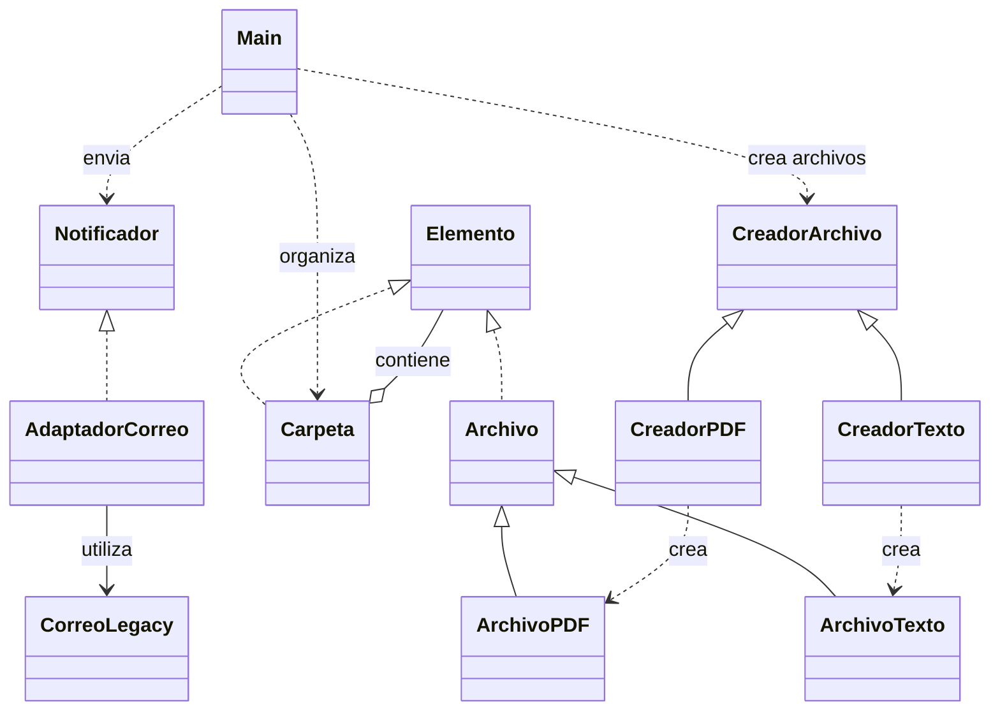

# Análisis

## Responsabilidades iniciales

- agregarArchivo elegía el tipo, construía el archivo y lo agregaba a la carpeta.
- obtenerTamanio recorría archivos y subcarpetas para sumar sus tamaños.
- enviarResultado creaba el servicio de correo y enviaba el total.

## Problemas y cambios

| Dónde | Problema y cambio difícil | Responsable final |
| --- | --- | --- |
| Main.obtenerTamanio y las dos listas de Carpeta | El cálculo dependía de distinguir archivos de carpetas; agregar otro elemento obligaba a revisar el recorrido. | Elemento define obtenerTamanio; Archivo devuelve su tamaño y Carpeta suma una lista de Elemento. |
| Main.agregarArchivo | Elegía tipos mediante if/else; agregar un tipo modificaba el método. | CreadorArchivo define crearArchivo y cada creador concreto construye su producto. |
| Main.enviarResultado | Dependía directamente del método send_email del proveedor. | Recibe Notificador; AdaptadorCorreo delega en CorreoLegacy. |

## Correcciones

Se corrigió CreadorTexto para devolver ArchivoTexto. Se unificó el constructor de Archivo en el orden (nombre, tamanio), como en la guía y los creadores. Se agregaron ArchivoPDF y ArchivoTexto, ausentes en los adjuntos. Main usa los creadores y Carpeta.agregar, y ya no recorre listas antiguas.

## Diagrama final

Las flechas con triángulo representan herencia o implementación. Las demás indican uso o contenido.

## Resultado

Archivo conoce su tamaño; Carpeta calcula el total de sus elementos; los creadores construyen productos; el adaptador traduce enviar a send_email. Main organiza el ejemplo. Para quien ejecuta el programa permanecen iguales el total 250, el destinatario y el texto del correo simulado.

## Pruebas después del cambio

| Entrada | Esperado | Obtenido | Resultado |
| --- | ---: | ---: | --- |
| Carpeta vacía | 0 | 0 | OK |
| PDF de 120 | 120 | 120 | OK |
| PDF de 120 y texto de 80 | 200 | 200 | OK |
| Ejemplo con subcarpeta de 50 | 250 | 250 | OK |
| Archivo de tamaño 0 | 0 | 0 | OK |

Se verificaron además los tipos devueltos por ambos creadores, el envío mediante un Notificador de prueba y la salida exacta de Main, que utiliza el adaptador real.

Las pruebas anteriores a la refactorización deben registrarse ejecutando la versión inicial de la guía o el commit original; no se inventó esa evidencia a partir del resultado final.
