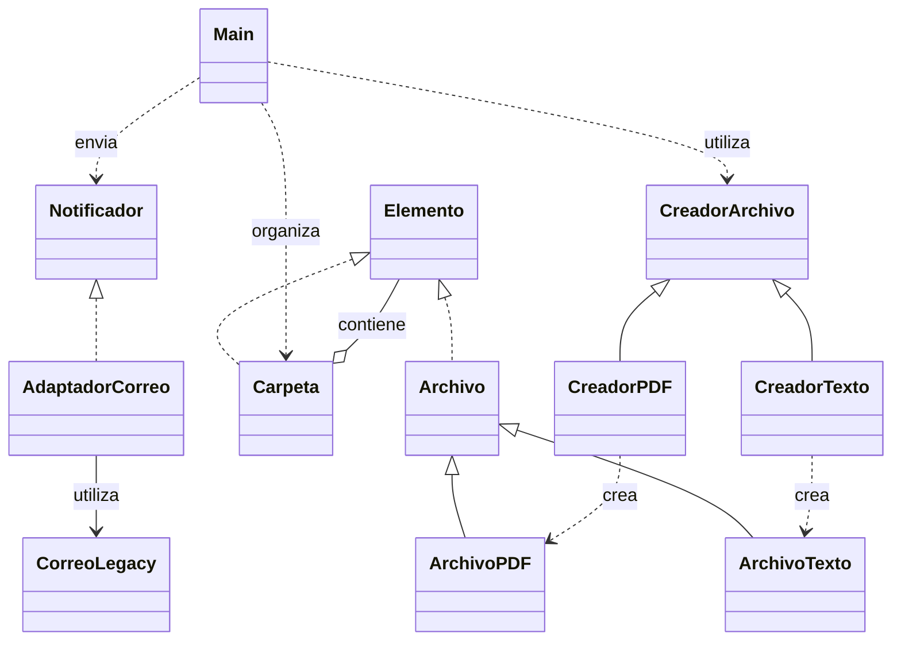

# Análisis de la práctica 3

## Etapa 1. Detectar qué hace cada parte

### 1. ¿De qué se encarga agregarArchivo?

En el código inicial recibe una carpeta, el tipo, el nombre y el tamaño. Decide mediante un `if/else` si crea un `ArchivoPDF` o un `ArchivoTexto` y lo agrega a la lista de archivos de la carpeta.

### 2. ¿De qué se encarga obtenerTamanio?

Suma los tamaños de los archivos de una carpeta y recorre recursivamente sus subcarpetas para incluir también sus tamaños.

### 3. ¿De qué se encarga enviarResultado?

Crea un `CorreoLegacy`, obtiene el tamaño total y llama a `send_email` para enviar el mensaje simulado al destinatario indicado.

### 4. Tres problemas concretos

| Dónde aparece | Problema | Qué cambio sería difícil | Clase o interfaz responsable |
| --- | --- | --- | --- |
| `Main.obtenerTamanio` y las listas separadas de `Carpeta` | **Acoplamiento Alto y Duplicación:** Main conoce la estructura interna de la carpeta y realiza el cálculo por partes con la misma lógica. | Incorporar otra clase de elemento obligaría a revisar el recorrido y las colecciones. | `Elemento` define el contrato; `Archivo` y `Carpeta` calculan su tamaño. |
| `Main.agregarArchivo` | **Acoplamiento Alto y Condicionales Explosivos:** Main decide qué clase concreta construir mediante condiciones. | Agregar otro tipo de archivo exigiría modificar la selección. | `CreadorArchivo` y sus creadores concretos. |
| `Main.enviarResultado` | **Rigidez y Dependencia de Terceros:** El envío depende directamente del servicio y de su método `send_email`. | Cambiar de proveedor obligaría a cambiar este método. | `Notificador` y un adaptador para el proveedor. |

## Etapa 2. Preparar y comprobar las pruebas

| Entrada | Esperado  |
| --- | ---: |
| Carpeta vacía | 0 | 
| Un PDF de 120 | 120 | 
| PDF de 120 y texto de 80 | 200 | 
| Ejemplo completo con subcarpeta de 50 | 250 |
| Archivo de tamaño 0 | 0 |


## Etapa 3. Composite

### Cambios realizados

Se sustituyeron las listas `archivos` y `subcarpetas` por `List<Elemento>`. `agregar` incorpora archivos o carpetas a esa lista. El cálculo pasó de `Main` a los elementos y las llamadas usan `carpeta.obtenerTamanio()`.

## Etapa 4. Factory Method

### Cambios realizados

Main utiliza los creadores y agrega sus productos mediante `Carpeta.agregar`. Se retiró la selección antigua con `if/else`. Se corrigió `CreadorTexto`, que en la versión parcial construía un PDF. El constructor de `Archivo` usa el orden `(nombre, tamanio)`.

## Etapa 6. Comprobar y explicar la solución

### 1. Resultados de los cinco casos después del cambio

| Entrada | Esperado | Obtenido | Resultado |
| --- | ---: | ---: | --- |
| Carpeta vacía | 0 | 0 | OK |
| Un PDF de 120 | 120 | 120 | OK |
| PDF de 120 y texto de 80 | 200 | 200 | OK |
| Ejemplo completo con subcarpeta de 50 | 250 | 250 | OK |
| Archivo de tamaño 0 | 0 | 0 | OK |

`Pruebas.comprobar` compara el esperado con el obtenido y muestra `OK` o `FALLO`. Las pruebas se ejecutan mediante el método `main` de `Pruebas`, separado del ejemplo de `Main`.

### 2. Salida del ejemplo

La salida verificada de Main conserva el resultado inicial:

```text
250
Para: profesor@universidad.edu
Tamanio total: 250
```

### 3. Diagrama final



La flecha continua con triángulo representa herencia; la discontinua con triángulo, implementación de una interfaz. El rombo indica que una carpeta contiene elementos. Las flechas restantes representan uso de otra clase o interfaz.

### 4. ¿Qué responsabilidad se movió a cada clase?

| Clase o interfaz | Responsabilidad final |
| --- | --- |
| `Elemento` | Define la operación común para obtener el tamaño. |
| `Archivo` | Almacena nombre y tamaño y devuelve el tamaño individual. |
| `ArchivoPDF` y `ArchivoTexto` | Representan los dos productos concretos. |
| `Carpeta` | Guarda elementos y suma sus tamaños, incluidas las subcarpetas. |
| `CreadorArchivo` | Define el método de creación. |
| `CreadorPDF` y `CreadorTexto` | Construyen su producto concreto. |
| `Notificador` | Define el contrato de envío que espera el programa. |
| `AdaptadorCorreo` | Traduce la llamada de envío al servicio existente. |
| `CorreoLegacy` | Realiza el envío simulado mediante impresión en consola. |
| `Main` | Organiza el ejemplo, muestra el total y solicita la notificación. |
| `Pruebas` | Prepara los casos y compara los resultados con los esperados. |

### ¿Qué permaneció igual para quien usa el programa?

El ejemplo sigue sumando 120 + 80 + 50 = 250. Se conserva el destinatario `profesor@universidad.edu` y el mensaje `Tamanio total: 250`. La organización interna cambió, pero el resultado del ejemplo no.
